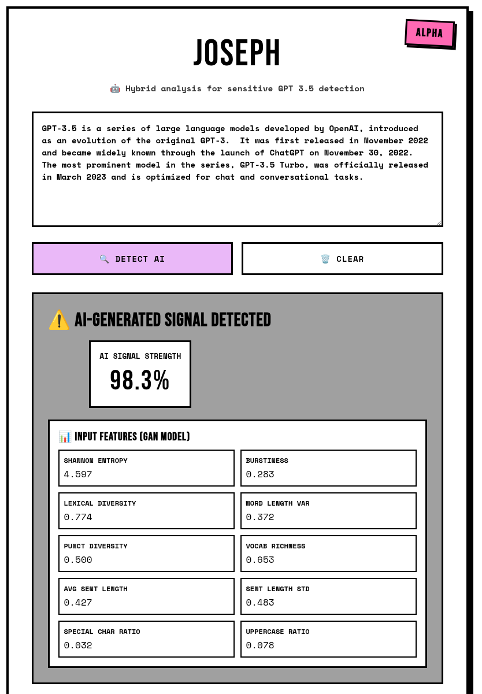

# Joseph

[](https://github.com/JamesABaker/verif/actions/workflows/docker.yml)
[](https://github.com/JamesABaker/verif/actions/workflows/prek.yml)
[](https://github.com/JamesABaker/verif/actions/workflows/tests.yml)

> *"Too many notes."* — Emperor Joseph II to Mozart

**Joseph** is a an AI text detection system combining machine learning with information theory.

## Features

- 🥊 **Generative Adversarial Network (GAN)** - The model fights itself to get better!
- 📊 **Information Theory** - Shannon entropy, burstiness, lexical diversity _and more_!
  - 🎯 **Sensitive Against Modern LLMs** - entropy features work on GPT-3.5 output... Yes we're a little behind the times. :point_down:
- 🐳 **Fully containerized** - runs anywhere with Docker
- 🌐 **Web UI + REST API** - easy to use, easy to integrate

> ⚠️ **Alpha Model Limitations**: This lightweight model is trained primarily on ChatGPT-3.5 and early GPT-4 data and performs significantly worse on GPT-5 output (F1 score ~0.62). See [Model Evaluation Report](docs/MODEL_EVALUATION.md) for detailed performance metrics.



## Quick Start

### Run with Docker Compose (Recommended)

Install [Docker](https://docs.docker.com/get-docker/) if you haven't already.

```bash
git clone https://github.com/JamesABaker/joseph.git
cd joseph
docker compose up --build
```

The application will be available at:
- **Web UI**: http://localhost:8000
- **API Docs**: http://localhost:8000/docs
- **Health Check**: http://localhost:8000/health

## Usage

### Web Interface

1. Open http://localhost:8000 in your browser
2. Paste or type text into the textarea
3. Click "Detect AI"
4. View the results

### Interactive API Documentation

Visit http://localhost:8000/docs for interactive API documentation with a built-in testing interface.

## Development

### Local Development Setup

**Using uv (recommended)**
```bash
# Install uv if you don't have it
curl -LsSf https://astral.sh/uv/install.sh | sh

# Install production dependencies
uv pip install -e .

# For training (optional)
uv pip install -e ".[training]"

# For development and testing
uv pip install -e ".[dev]"

# Install prek hooks (drop-in replacement for pre-commit)
prek install

# Run tests
uv run pytest -v
```

## Model Information

- **Architecture**: GAN-based discriminator (adversarially trained)
- **Features**: 10 statistical metrics (no large language models)
  - **Shannon Entropy**: Character-level information density
  - **Burstiness**: Sentence length variation (human writing varies more)
  - **Lexical Diversity**: Unique word ratio (type-token ratio)
  - **Word Length Variance**: Human vocabulary shows wider range
  - **Punctuation Diversity**: Humans use more varied punctuation
  - **Vocabulary Richness**: Yule's K statistic measures lexical repetition
  - **Sentence Statistics**: Length means and standard deviations
  - **Character Ratios**: Special characters and uppercase patterns
- **Performance**: 91.8% accuracy, 87.2% F1-score on ChatGPT-3.5 & 4 detection
- **Memory**: ~80MB RAM (lightweight, no transformers)


## Future Enhancements

- [ ] Batch processing API endpoint
- [x] API rate limiting
- [x] User ~2fa~ authentication
- [ ] Method refinement
- [x] Deployment
- [x] Volume data persistence for users
- [ ] Retrain on GPT 5+ data


## License

MIT License - feel free to use this project for learning, development, or production.
