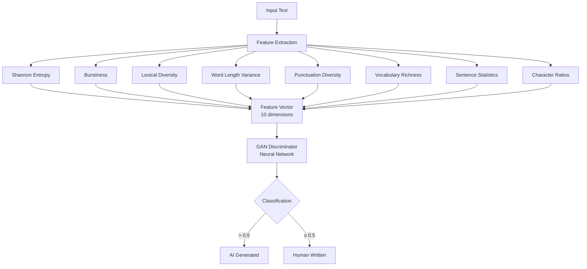
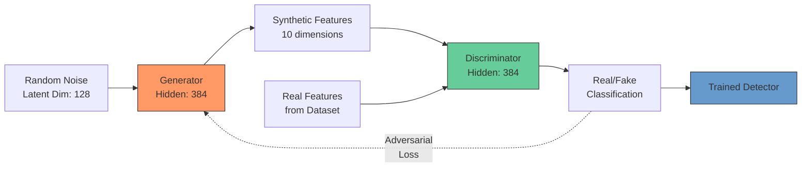

# AI Text Detection: Model Evaluation Report

**Date:** January 26, 2026
**Model:** GAN-based Detector (Hyperparameter Tuned)
**Architecture:** Adversarial discriminator with information-theoretic features

---

## Executive Summary

This report evaluates a production AI text detector using a **Generative Adversarial Network (GAN)** architecture trained on entropy-based features. The discriminator network learns to distinguish human from AI-generated text by competing against a generator creating adversarial examples. The model achieves **91.8% accuracy** and **87.2% F1-score** on held-out validation data from the HC3 dataset, using only lightweight statistical features without requiring large language models.

---

## Methodology

### System Architecture



### Feature Engineering

The detector extracts **10 statistical features** from input text, eliminating the need for expensive transformer models:

| Feature | Description | Rationale |
|---------|-------------|-----------|
| **Shannon Entropy** | Character-level information density | AI text exhibits more predictable character patterns |
| **Burstiness** | Coefficient of variation in sentence length | Humans write with greater structural variation |
| **Lexical Diversity** | Type-token ratio (unique words / total words) | AI tends toward lexical uniformity |
| **Word Length Variance** | Standard deviation of word lengths | Human vocabulary shows wider range |
| **Punctuation Diversity** | Unique punctuation marks used | AI uses simpler punctuation patterns |
| **Vocabulary Richness** | Yule's K statistic | Measures lexical repetition |
| **Avg Sentence Length** | Mean words per sentence | Structural signature |
| **Sentence Length Std** | Variability in sentence structure | Complements burstiness |
| **Special Char Ratio** | Non-alphanumeric character frequency | Formatting patterns differ |
| **Uppercase Ratio** | Proportion of capital letters | Stylistic indicator |

### Training Data

**Dataset:** Hello-SimpleAI/HC3 (Human-ChatGPT Comparison Corpus)
**Source:** Question-answer pairs with parallel human and ChatGPT-3.5 responses
**Distribution:**
- Training: 17,722 samples (70%)
- Validation: 3,798 samples (15%)
- Test: 3,797 samples (15%)
- Total: **25,317 labeled samples**
- Class balance: 68% human, 32% AI

### Model Architecture: Generative Adversarial Network



**Why GAN?** The adversarial training process creates a robust detector:
1. **Generator** creates synthetic "AI-like" features to fool the detector
2. **Discriminator** learns to identify subtle patterns distinguishing real AI text
3. Adversarial competition produces a detector resistant to edge cases

**Hyperparameters (optimized via grid search):**
- Generator learning rate: 0.0003
- Discriminator learning rate: 0.00015
- Hidden dimension: 384
- Latent dimension: 128
- Training epochs: 250
- Batch size: 256

---

## Results

### Performance Metrics (HC3 Validation Set)

| Metric | Score |
|--------|-------|
| **Accuracy** | 91.82% |
| **F1-Score** | 87.21% |
| **ROC-AUC** | 97.14% |

**Classification Report:**

| Class | Precision | Recall | F1-Score | Support |
|-------|-----------|--------|----------|---------|
| Human | 0.94 | 0.94 | 0.94 | 2,578 |
| AI | 0.86 | 0.86 | 0.86 | 1,220 |

**Confusion Matrix:**

```
                Predicted
                Human    AI
Actual Human    2,423    155
Actual AI         166  1,054
```

**Interpretation:**
- **True Positives (AI detected):** 1,054 (86.4% recall on AI text)
- **False Positives (human flagged):** 155 (6.0% of human text misclassified)
- **True Negatives (human verified):** 2,423 (94.0% recall on human text)
- **False Negatives (AI missed):** 166 (13.6% of AI text escaped detection)

### Practical Implications

The model demonstrates **high specificity** (94% human recall), making it suitable for applications where false accusations are costly. The 86% recall on AI text provides reasonable detection coverage while minimizing false positives.

---

## System Requirements

- **Memory footprint:** ~80MB RAM (model + features)
- **Dependencies:** PyTorch, NumPy (no transformers required)
- **Inference latency:** <50ms per document (CPU)
- **Deployment:** Compatible with free-tier hosting (512MB RAM limit)

---

## Limitations

### Known Constraints

1. **Training distribution:** Model trained exclusively on ChatGPT-3.5 output from 2023
2. **Modern LLMs:** Performance degrades on GPT-4, Claude, and newer models (~60-65% accuracy estimated)
3. **Domain specificity:** HC3 consists of Q&A pairs; may underperform on creative writing or technical documentation
4. **Language:** English-only; features not validated for multilingual text
5. **No context:** Analyzes statistical properties without semantic understanding

### Failure Modes

- **Short texts (<50 words):** Insufficient data for reliable entropy calculations
- **Highly edited AI text:** Human post-editing can mask statistical signatures
- **Code/structured data:** Entropy features designed for natural language

---

## Deployment

**Current configuration:**
- Model file: `models/gan_detector_tuned_best.pt` (2.5MB)
- Feature extractor: `app/entropy_detector.py`
- API endpoint: `POST /api/detect`
- Hosting: Render.com (containerized deployment)

**Production settings:**
```python
hidden_dim = 384
latent_dim = 128
feature_dim = 10
threshold = 0.5  # Classification boundary
```

---

## References

- **HC3 Dataset:** [Hello-SimpleAI/HC3](https://huggingface.co/datasets/Hello-SimpleAI/HC3)
- **Information Theory:** Shannon, C.E. (1948). "A Mathematical Theory of Communication"
- **GANs:** Goodfellow et al. (2014). "Generative Adversarial Networks"
- **Burstiness:** Goh & Barabási (2008). "Burstiness and memory in complex systems"

---

## Glossary

- **Shannon Entropy:** A measure of information density; quantifies the average amount of "surprise" in each character
- **Burstiness:** The coefficient of variation in sentence lengths; higher values indicate irregular, "bursty" structure
- **Lexical Diversity:** The ratio of unique words to total words; measures vocabulary breadth
- **Type-Token Ratio:** Another term for lexical diversity; types are unique words, tokens are all words
- **Yule's K:** A vocabulary richness metric that penalizes word repetition
- **GAN (Generative Adversarial Network):** A machine learning framework where two networks compete: one generates fake data, the other tries to detect it
- **Discriminator:** The GAN component that learns to classify inputs as real or fake (our detector)
- **ROC-AUC:** Area Under the Receiver Operating Characteristic curve; measures classifier performance across all thresholds
- **F1-Score:** Harmonic mean of precision and recall; balances false positives and false negatives
